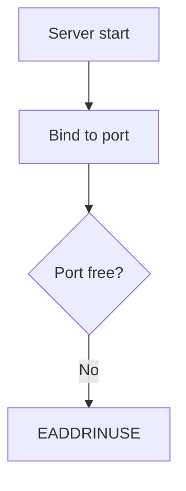
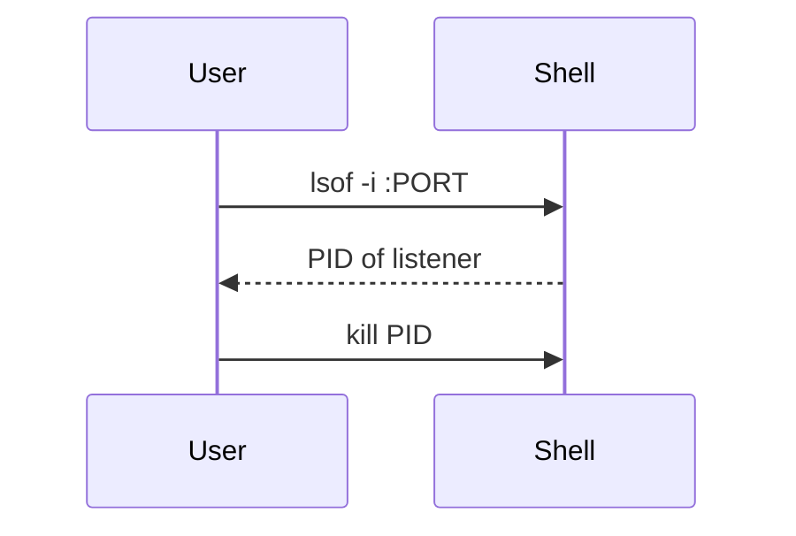

# Errata — Design Document

**Status:** Implemented (v1 + review/SM-2 shipped; merge-review queue deferred)
**Date:** 2026-09-20
**Working name:** Errata

---

## 1. Problem Statement

Developers increasingly paste errors into AI assistants, accept the fix, and move on — without reading, understanding, or retaining anything. The AI's reasoning evaporates the moment the chat scrolls away. The same developer hits the same class of error weeks later and repeats the cycle, never building the mental model that turns errors into expertise.

**The learning loop is broken:** error → paste → fix → forget.

## 2. Product Vision

Errata is a local-first knowledge engine that sits between AI coding assistants and the developer. It captures every error the AI solves — the error itself, the root cause, and the fix — stores it in a personal graph database, generates permanent documentation with diagrams, and **interrupts the developer at the exact moment a known error recurs**, giving them the chance to solve it themselves first.

**The repaired loop:** error → *"you've seen this 3× before"* → attempt or defer → fix → documented forever → resurfaces until learned.

### Design principles

1. **Learning at the moment of error** — not in a separate app the user must remember to open.
2. **Local-first, user-owned data** — no accounts, no cloud AI calls, no telemetry. Graph data lives in the user's own online Neo4j instance (AuraDB or self-hosted via connection string); vault docs, diagrams, and config live locally under `~/.errata/` (`vault/`, `config.json`, or `ERRATA_VAULT_PATH` override).
3. **The solving AI writes the docs** — it has the richest context; the server structures and stores.
4. **The graph is the memory** — recurrence, relationships, and concepts are first-class, enabling spaced repetition and team sharing later without schema migration.
5. **Docs outlive the product** — plain Markdown + Mermaid vault, Obsidian-compatible.
6. **Offline-capable matching** — embeddings and fingerprinting run locally with zero API keys; when Neo4j is unconfigured the server falls back to an in-memory store so the check → log loop still works.

---

## 3. Decisions Log (agreed during brainstorming)

| # | Decision | Choice | Rationale |
|---|----------|--------|-----------|
| 1 | Capture mechanism | **MCP server** | Structured data straight from the AI's reasoning; works across Claude Code, Cursor, Windsurf, Continue; no screen-scraping |
| 2 | Audience | **Solo first, teams later** | Zero auth/privacy burden in v1; schema designed so team mode needs no migration |
| 3 | Learning loop | **All three, phased** | v1: interrupt-at-error + auto-docs; v2: spaced repetition — one graph schema supports all |
| 4 | Viewing surface | **Markdown vault + Next.js dashboard** | User owns portable docs forever; Next.js dashboard provides graph viz, stats, review UI |
| 5 | Tech stack | **TypeScript + Neo4j online graph DB + Next.js dashboard** | Official MCP SDK is TS-first; Neo4j = online cloud graph database (AuraDB or remote instance via `NEO4J_URI`/`NEO4J_URL` + credentials) with Cypher + vector index; Next.js App Router for dashboard; no cloud embedding vendor |
| 6 | Matching engine | **Hybrid: fingerprint + local embeddings (384-dim)** | Deterministic exact-class matching plus semantic similarity; local Transformers.js (`Xenova/all-MiniLM-L6-v2`) when `@huggingface/transformers` is installed, otherwise deterministic 384-dim hash fallback — same dimension so the Neo4j vector index never mismatches |
| 7 | Doc generation | **Client AI writes, server stores** | The solving model has full context; no API key management; works offline; vault file is authoritative for `doc_path` |

Additional decision made in design: **embeddings run locally** (384 dims, `Xenova/all-MiniLM-L6-v2` via Transformers.js when installed, else a deterministic local hash embedding of the same dimension) — no API key, matching works fully offline, consistent with local-first principle. Set `ERRATA_DISABLE_LOCAL_MODEL=1` to force the hash fallback. Thresholds are env-tunable: `ERRATA_AUTO_MERGE_THRESHOLD` (default `0.6`), `ERRATA_NEAR_MISS_THRESHOLD` (default `0.45`).

---

## 4. System Architecture

```
┌──────────────┐   MCP protocol    ┌─────────────────────────┐
│  AI Client   │◄────────────────►│  Errata MCP Server (TS) │
│ Claude Code, │  tools + server  │                         │
│ Cursor, etc. │  instructions    │  ┌───────────────────┐  │
└──────────────┘                  │  │ Capture Engine    │  │
                                  │  │ validate + store  │  │
                                  │  ├───────────────────┤  │
                                  │  │ Matching Engine   │  │
                                  │  │ fingerprint+embed │  │
                                  │  ├───────────────────┤  │
                                  │  │ Vault Writer      │  │
                                  │  │ md + mermaid      │  │
                                  │  └───────────────────┘  │
                                  └────────────┬────────────┘
              ┌────────────────────────────────┼────────────────────┐
              ▼                                ▼                    ▼
       ┌─────────────┐                ┌────────────────┐   ┌──────────────┐
       │ Neo4j DB    │                │ Markdown Vault │   │ Dashboard    │
       │ Online Cloud│                │ .md + Mermaid  │   │ Next.js App  │
       │ neo4j+s://  │                │ Obsidian-ready │   │ localhost    │
       └─────────────┘                └────────────────┘   └──────────────┘

Graph data in Online Neo4j DB (via `NEO4J_URI` or `NEO4J_URL` + username/password/database).
Local vault and config under `~/.errata/` (`vault/`, `config.json`), overridable via `ERRATA_VAULT_PATH`.
When Neo4j is unconfigured, the MCP server and API routes fall back to an in-memory store so the check → log loop still works (graph features degrade gracefully).
The dashboard additionally exposes Next.js API routes (`/api/check-error`, `/api/log-resolution`, `/api/graph`, `/api/timeline`, `/api/errors`, `/api/errors/[id]`, `/api/stats`, `/api/search`, `/api/review`, `/api/seed`, `/api/events` SSE, `/api/neo4j/status`, `/api/neo4j/setup`), an in-app MCP simulator, a demo seeder (12 curated error classes), and a live event bus (capture / check_match / check_new toasts).
```

### 4.1 Components and isolation

| Component | Responsibility | Depends on | Testable via |
|-----------|---------------|------------|--------------|
| **MCP Server** (`bin/errata-mcp.ts`) | Exposes 7 tools, holds server instructions + `errata_workflow` prompt, routes calls | Capture Engine, Matching Engine, stats/search/review queries | `npm run test:mcp` headless harness |
| **Capture Engine** (`lib/capture.ts`) | Validates payloads, writes ErrorClass/Occurrence/RootCause/Fix/Technology/Concept/File/Project/DocPage nodes + edges, updates counters | Neo4j Driver (or in-memory fallback) | `test:mcp` loop asserting graph/vault state |
| **Matching Engine** (`lib/matching.ts` + `lib/normalizer.ts` + `lib/embeddings.ts`) | Fingerprint normalization, local embedding, cosine similarity, tech-overlap gating, near-miss list | Neo4j Cypher (or in-memory scan); local model or hash fallback | `npm run test:normalizer` golden corpus |
| **Vault Writer** (`lib/vault.ts`) | Renders stored error data → Markdown + Mermaid files; filename is authoritative for `doc_path` | Templates | Generated-doc existence check in `test:mcp` |
| **Dashboard** (`app/`, `components/`, `hooks/`) | 7 tabs (graph, timeline, vault, stats, review, search, simulator) + Neo4j config modal + live toasts over graph + vault | Next.js API routes & Neo4j (or in-memory) | Manual + e2e |

Each unit has one purpose, communicates through a typed interface, and can be understood without reading its internals.

---

## 5. The Core Loop (v1)

1. User's code errors; the AI client prepares to fix it.
2. **Server instructions + tool descriptions nudge the AI to call `check_error` first**, passing the error text, stack trace, and command/code context.
3. Matching engine runs: fingerprint → embedding similarity → returns match record:
   *"Seen 3× before. Root cause: port already bound. Last seen: Sept 2. Doc: `eaddrinuse-port-in-use.md`"*
4. The AI surfaces the **interrupt prompt** to the user:
   > *"You've hit this error 3 times before. Root cause: another process is bound to the port. Want to try fixing it yourself first? (hint: find what's listening on the port)"*
   The user may attempt it, or let the AI proceed.
5. After solving, the AI calls **`log_resolution`** with structured arguments: error, root cause, fix, explanation, Mermaid diagrams it authored, tags, files touched.
6. The server stores the occurrence in the graph, increments counters, and writes/updates the vault doc.
7. Dashboard and vault are perpetually current. In v2, recurring error classes flow into the spaced-repetition review queue.

---

## 6. MCP Tool Contract

### 6.1 `check_error` — called BEFORE fixing

**Input**
```json
{
  "error_message": "Error: listen EADDRINUSE: address already in use :::3000",
  "stack_trace": "…optional…",
  "context": "command or code snippet that triggered it",
  "project": "optional project hint",
  "technology": ["node", "express"]
}
```

**Output** (implemented superset — `title`, `match_layer`, `similarity_score` are extra but harmless)
```json
{
  "match": true,
  "error_class_id": "ec_9f2a",
  "title": "EADDRINUSE: port already in use",
  "occurrence_count": 3,
  "first_seen": "2026-07-14",
  "last_seen": "2026-09-02",
  "root_cause": "Another process is already bound to the port",
  "past_fix_summary": "Find and kill the listener (lsof -i :PORT) or change ports",
  "doc_path": "errors/2026-07-14-eaddrinuse-port-in-use.md",
  "interrupt_prompt": "You've hit this 3× before. Want to try fixing it yourself first?",
  "match_layer": "fingerprint | semantic | none",
  "similarity_score": 1.0,
  "similar_but_unmatched": [ { "error_class_id": "ec_1b77", "title": "…", "similarity": 0.86 } ]
}
```

### 6.2 `log_resolution` — called AFTER fixing

**Input**
```json
{
  "error_message": "…",
  "stack_trace": "…",
  "root_cause": "…",
  "fix": "…",
  "explanation": "Plain-English explanation of what happened and why",
  "diagrams": [
    { "kind": "root_cause_flow", "mermaid": "flowchart TD …" },
    { "kind": "fix_sequence", "mermaid": "sequenceDiagram …" }
  ],
  "technology": ["node", "express"],
  "files": ["src/server.ts"],
  "project": "api-server",
  "concepts": ["ports", "process management"],
  "matched_error_class_id": "ec_9f2a",
  "user_solved_unaided": false
}
```

**Output** (implemented superset — includes `title`)
```json
{
  "error_class_id": "ec_9f2a",
  "title": "EADDRINUSE: port already in use",
  "occurrence_count": 4,
  "doc_path": "errors/2026-07-14-eaddrinuse-port-in-use.md",
  "notice": "4th occurrence — doc updated; added to review queue",
  "suggested_review": true
}
```

`suggested_review` is `true` when `occurrence_count >= 3`. `doc_path` is the vault-authoritative slug filename actually written (see §9), stored back onto the `ErrorClass` node.

### 6.3 Supporting tools (all implemented in `bin/errata-mcp.ts`)

| Tool | Purpose | Phase | Notes |
|------|---------|-------|-------|
| `get_error_doc` | Return full Markdown doc for an error class (`doc_path`) | v1 ✅ shipped | Reads from local vault; `isError` when missing |
| `search_errors` | Keyword search over error classes (`query`, `limit`) | v1.5 ✅ shipped (keyword; embedding-ranked search deferred) | Cypher `CONTAINS` on title/root-cause/fix; `[]` offline |
| `get_stats` | Recurrence stats, top error classes, recidivism/self-solve rates, tech + concept breakdowns | v1 ✅ shipped | Neo4j or in-memory fallback |
| `get_review_queue` | Spaced-repetition cards due (`limit`; `review_due_date IS NULL OR <= today`, ordered by recurrence) | v2 ✅ shipped early | Backed by same SM-2 fields as `/api/review` |
| `submit_review_result` | Record recall outcome (`error_class_id`, `rating: again\|hard\|good\|easy`; feeds SM-2 `ease_factor`/`current_interval`/`review_due_date`) | v2 ✅ shipped early | Offline returns `{ ok: true, offline: true }` |

Merge-review queue (`SIMILAR_TO` approve/reject surface): **deferred — not implemented**. Near-misses are returned in `similar_but_unmatched` but not persisted.

### 6.4 Capture compliance (the #1 product risk)

Tool-calling is prompt-based; we cannot *force* the AI to comply. Mitigations, in order of leverage:

1. **Server `instructions` field** — explicit protocol: "Before fixing any error, call `check_error`. After fixing, call `log_resolution`."
2. **Tool descriptions** written as behavioral contracts, not API docs.
3. **Value to the AI itself** — `check_error` returns real past fixes, making the AI faster and more accurate; it is rewarded for calling.
4. **E2E compliance metric** — scripted real sessions on Claude Code and Cursor measuring capture rate; this metric decides whether the product lives or dies (see §12).

---

## 7. Matching Engine

### 7.1 Layer 1 — Fingerprint (deterministic)

Normalization pipeline applied to `error_message` + top stack frames:

1. Strip quoted strings (`"…"`, `'…'`, `` `…` ``)
2. Strip numbers, ports, hex IDs, UUIDs, timestamps
3. Strip absolute paths (keep file basenames)
4. Normalize whitespace, lowercase
5. Template = normalized message + error type + top in-project stack-frame signature
6. `fingerprint = sha256(template)`

`EADDRINUSE :::3000` and `EADDRINUSE :::8080` produce the **same fingerprint** → same `ErrorClass`. Exact-hash matching is instant with zero false positives.

### 7.2 Layer 2 — Embeddings (semantic, local-only)

- Model: `Xenova/all-MiniLM-L6-v2` via Transformers.js when `@huggingface/transformers` is installed, else a deterministic 384-dim local hash embedding (word + 3–5-gram char features, signed MD5 bucketing, L2-normalized). Both are 384-dim so the Neo4j vector index never mismatches. No cloud calls, ever.
- Embedded text (implemented): `check_error` embeds the **normalized error message** (no root cause exists yet); `log_resolution` embeds **normalized error + root cause**. (Spec ideal is normalized error + root cause everywhere; `context` is accepted but not embedded.)
- Stored in Neo4j (property `embedding` on `ErrorClass` nodes); at check time candidates are scanned with in-code cosine similarity (Neo4j vector index is created for future use). Offline/in-memory mode scans the in-memory map the same way.
- Match requires **both** cosine ≥ auto-merge threshold (default **0.6**, env `ERRATA_AUTO_MERGE_THRESHOLD`; calibrated 2026-09-19 on all-MiniLM-L6-v2: same-class paraphrase 0.63–0.72, same-family different-cause 0.47, different-class 0.24, unrelated ~0.0) **and** technology-tag overlap — implemented strictly: if the caller supplies `technology[]`, the candidate must share ≥1 tag (untagged candidates do **not** auto-merge). Near-misses scoring 0.45–0.6 (`ERRATA_NEAR_MISS_THRESHOLD`) are returned in `similar_but_unmatched`, never auto-merged.

### 7.3 Merge-review queue

**Deferred — not implemented.** Candidates in the uncertain band are returned to the caller but not persisted and have no dashboard surface. The graph never silently merges (conservative thresholds + strict tech-tag requirement), but there is no approve/reject queue yet.

---

## 8. Graph Schema (Neo4j Cypher)

```
(Occurrence)  -[:INSTANCE_OF]->  (ErrorClass)  -[:CAUSED_BY]->  (RootCause)
(Occurrence)  -[:OCCURRED_IN]->  (File)        (ErrorClass)  -[:FIXED_BY]->   (Fix)
(Occurrence)  -[:OCCURRED_IN]->  (Project)     (ErrorClass)  -[:TAGGED]->     (Technology)
                                               (ErrorClass)  -[:SIMILAR_TO]-> (ErrorClass)
                                               (ErrorClass)  -[:TEACHES]->    (Concept)
                                               (ErrorClass)  -[:DOCUMENTED_IN]-> (DocPage)
```

### Node properties (core set)

| Node | Key properties |
|------|---------------|
| `ErrorClass` | id, fingerprint, title, embedding (384-float array), first_seen, last_seen, occurrence_count, self_solved_count, doc_path, root_cause (denormalized), past_fix_summary (denormalized), review_due_date, ease_factor, current_interval, last_reviewed |
| `Occurrence` | id, timestamp, raw_message, stack_trace, project (denormalized), user_solved_unaided (no `context`/`session_id` in code) |
| `RootCause` | id (`rc_<errorClassId>`), summary |
| `Fix` | id (`fix_<errorClassId>`), summary (no `steps` in code) |
| `Technology` | name |
| `Concept` | name (no `id`/`explanation` in code) |
| `File` | path (no uniqueness constraint in code) |
| `Project` | name |
| `DocPage` | path, updated_at (written on every capture; `DOCUMENTED_IN` edge created) |

Notes: `SIMILAR_TO` edges are **not written by capture** (deferred with merge-review). Dashboard graph renders a demo `SIMILAR_TO` link only for placeholder data.

### Neo4j Cypher Schema & Constraints

```cypher
// Uniqueness Constraints
CREATE CONSTRAINT error_class_id_unique IF NOT EXISTS FOR (e:ErrorClass) REQUIRE e.id IS UNIQUE;
CREATE CONSTRAINT error_class_fingerprint_unique IF NOT EXISTS FOR (e:ErrorClass) REQUIRE e.fingerprint IS UNIQUE;
CREATE CONSTRAINT occurrence_id_unique IF NOT EXISTS FOR (o:Occurrence) REQUIRE o.id IS UNIQUE;
CREATE CONSTRAINT tech_name_unique IF NOT EXISTS FOR (t:Technology) REQUIRE t.name IS UNIQUE;
CREATE CONSTRAINT concept_name_unique IF NOT EXISTS FOR (c:Concept) REQUIRE c.name IS UNIQUE;
CREATE CONSTRAINT project_name_unique IF NOT EXISTS FOR (p:Project) REQUIRE p.name IS UNIQUE;
CREATE CONSTRAINT docpage_path_unique IF NOT EXISTS FOR (d:DocPage) REQUIRE d.path IS UNIQUE;

// Performance Indexes
CREATE INDEX occurrence_timestamp IF NOT EXISTS FOR (o:Occurrence) ON (o.timestamp);

// Neo4j Vector Index (for semantic matching)
CREATE VECTOR INDEX error_class_embeddings IF NOT EXISTS
FOR (e:ErrorClass) ON (e.embedding)
OPTIONS { indexConfig: {
  `vector.dimensions`: 384,
  `vector.similarity_function`: 'cosine'
}};
```

### Why this shape

- **`ErrorClass` is the durable knowledge node; `Occurrence` is a timestamped event.** This powers "3× before," recurrence timelines, self-solve rate, and v2 spaced repetition — all from one schema.
- **`Concept` nodes** turn the graph into a learning map (e.g. "ports", "event loop"), enabling per-concept review later.
- **`SIMILAR_TO`** edges make the dashboard graph view genuinely exploratory.
- **Team mode (v3) only adds a `User` node and `SOLVED_BY` edges** — no migration of existing data.

---

## 9. Markdown Vault

```
~/.errata/vault/
  index.md
  errors/2026-07-14-eaddrinuse-port-in-use.md
  concepts/ports.md
  concepts/event-loop.md
```

### Error doc template

````markdown
---
id: ec_9f2a
title: "EADDRINUSE: port already in use"
first_seen: 2026-07-14
last_seen: 2026-09-19
occurrences: 4
self_solved: 1
tags: [node, express]
concepts: [[ports]], [[process-management]]
similar: [[2026-08-01-connection-refused]]
---

# EADDRINUSE: port already in use

## What happened
<plain-English explanation>

## Root cause


## The fix


## Occurrence log
| # | Date | Project | Solved by |
|---|------|---------|-----------|
| 4 | 2026-09-19 | api-server | AI |
| 3 | 2026-09-02 | side-project | **Me** |

## Learn this
- [ ] Can you explain why a port can only be bound once?
- [ ] Do you know two ways to free a port?
````

- YAML frontmatter keeps docs machine-readable (`similar:` is written only when similar links exist).
- `[[wiki-links]]` give free backlinks and graph view in Obsidian.
- Diagrams are authored by the solving AI (richest context) and passed through `log_resolution`; when absent the writer emits a generic fallback flowchart/sequence diagram (no Mermaid validation in code).
- Filename is `errors/<first_seen-date>-<slug(title, 40 chars)>.md`; the writer's return value is authoritative — capture stores exactly that path on the `ErrorClass`/`DocPage` nodes (previously capture guessed `<date>-<id>.md`, now fixed).
- `concepts/` pages are not generated; only `index.md` + `errors/` docs are written. Solved-by renders as `AI` / `**Me**`.
- "Learn this" checklist is currently three generic prompts (trigger conditions, reproduce-without-docs, CI prevention), not per-error questions.

---

## 10. Dashboard (Next.js App Router, served on localhost:3000)

| Tab | Contents | Phase | Status |
|------|----------|-------|--------|
| **Graph view** | Force-directed interactive graph: error classes, causes, fixes, concepts, technology nodes, occurrences | v1 | ✅ shipped (SIMILAR_TO only in demo placeholder data) |
| **Timeline** | Chronological occurrences with recurrence markers | v1 | ✅ shipped (no project filter in code) |
| **Vault / Error detail** | Error list + rendered doc + diagrams + occurrence log | v1 | ✅ shipped as `vault` tab |
| **Stats** | Top recurring classes, recidivism rate, self-solve rate, tech/concept breakdowns | v1 | ✅ shipped (no streaks UI in code) |
| **Merge review** | Approve/reject near-match candidates | v1.5 | ❌ deferred — not built |
| **Search** | Keyword search over the graph | v1.5 | ✅ shipped early (keyword `CONTAINS`; embedding-ranked search deferred) |
| **Review** | Flashcards with SM-2 (`again/hard/good/easy`) + due queue | v2 | ✅ shipped early |
| **Simulator** | In-app MCP check/log simulator + setup logs | — | ✅ extra (not in original spec) |

Plus: `DashboardHeader` (DB status, counts), `Neo4jConfigModal` (connection manager + schema setup runner), `LiveToasts` (SSE via `/api/events` on capture/check_match/check_new). The dashboard reads from Neo4j when configured, else in-memory + placeholder demo graph.

The Next.js dashboard visualizes graph insights, occurrence timelines, and stats from the online Neo4j database (or fallback store), while also rendering local vault markdown documents.

---

## 11. Feature Roadmap

### v1 — MVP ✅ shipped
- MCP server (TypeScript, official SDK) with server instructions + `errata_workflow` prompt
- Tools: `check_error`, `log_resolution`, `get_error_doc`, `get_stats`
- Hybrid matching engine (fingerprint + local 384-dim embeddings, strict tech-overlap)
- Neo4j schema + online graph DB storage (AuraDB or remote instance via `NEO4J_URI`/`NEO4J_URL`) + in-memory fallback
- Vault writer (Markdown + Mermaid, vault-authoritative `doc_path`, `DocPage` node)
- Dashboard: Next.js App Router with force-directed graph, timeline, vault detail, stats, connection manager, MCP simulator, live toasts, demo seeder
- Scripts: `mcp` (stdio server), `test:normalizer`, `test:mcp`, `seed` (12 curated error classes)

### v1.5 (partial)
- `search_errors` + dashboard search ✅ shipped (keyword; embedding-ranked + export deferred)
- Merge-review queue ❌ deferred
- Per-project filtering and Markdown export ❌ deferred

### v2 — Spaced repetition ✅ shipped early
- SM-2 scheduling over `ErrorClass` (`ease_factor`, `current_interval`, `review_due_date`, `last_reviewed`)
- `get_review_queue`, `submit_review_result` (MCP + `/api/review` GET/POST)
- Review UI (flashcards) ✅ (recall analytics deferred)

### v3 — Teams
- Cloud sync, shared org graph, auth
- Code-context sanitization before anything leaves the machine
- Built on the existing schema (adds `User` node only)

---

## 12. Testing Strategy & Risks

### Testing

| Level | Coverage | Implementation |
|-------|----------|----------------|
| **Unit** | Fingerprint normalizer golden corpus | `npm run test:normalizer` (`scripts/test-normalizer.ts`): port-variation, path-basename, quoted-string, cross-category checks ✅ |
| **Integration** | Headless check → log → check loop | `npm run test:mcp` (`scripts/test-mcp.ts`): asserts match flip, vault write, stats ✅ |
| **E2E** | Capture compliance rate on real clients | ❌ not implemented — no scripted Claude Code/Cursor sessions |
| **Typecheck** | — | `npx tsc --noEmit` ✅ (eslint reports pre-existing `any` warnings) |

### Risks and mitigations

| Risk | Impact | Mitigation (implemented) |
|------|--------|--------------------------|
| AI doesn't reliably call the tools | Product is empty | §6.4: instructions field + `errata_workflow` prompt, behavioral tool descriptions, value-to-the-AI design; compliance metric **not** implemented |
| Bad embedding merges corrupt the graph | Wrong "seen before" claims | Conservative thresholds (0.6/0.45, env-tunable) + **strict** tech-tag requirement (caller tech must overlap); merge-review queue **deferred** |
| Diagram quality varies by client model | Ugly docs | **Not mitigated in code** — no Mermaid validation; generic fallback diagrams only when `diagrams[]` absent |
| Scope creep | Nothing ships | Phasing (§11) updated to reflect shipped vs deferred |

---

## 13. Data & Privacy

- Graph data lives in the user's **own Online Neo4j Graph DB** (Neo4j AuraDB or self-hosted instance connected via TLS/`neo4j+s://` connection string). Env: `NEO4J_URI` or `NEO4J_URL` (with embedded credentials/database) + `NEO4J_USERNAME`/`NEO4J_USER`, `NEO4J_PASSWORD`, `NEO4J_DATABASE`.
- Markdown docs and diagrams live locally under `~/.errata/vault/` (override: `ERRATA_VAULT_PATH`).
- Local config under `~/.errata/config.json`.
- Embeddings run locally (Transformers.js when installed, else local hash fallback; `ERRATA_DISABLE_LOCAL_MODEL=1` forces fallback). Matching thresholds: `ERRATA_AUTO_MERGE_THRESHOLD` (0.6), `ERRATA_NEAR_MISS_THRESHOLD` (0.45). No cloud AI calls, no telemetry.
- When Neo4j is unconfigured, everything runs against an in-memory store (no persistence across restarts).
- v3 team sharing is opt-in and gated behind context sanitization.
