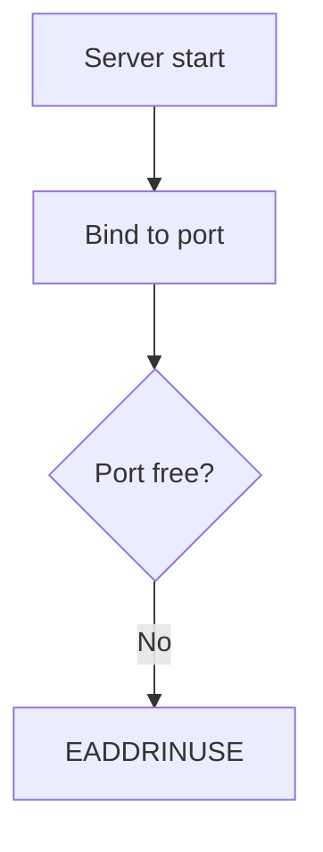
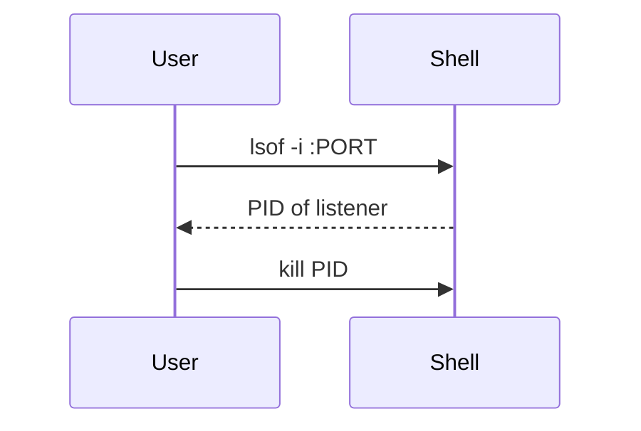

# Errata — Design Document

**Status:** Approved for implementation planning
**Date:** 2026-09-19
**Working name:** Errata (subject to change)

---

## 1. Problem Statement

Developers increasingly paste errors into AI assistants, accept the fix, and move on — without reading, understanding, or retaining anything. The AI's reasoning evaporates the moment the chat scrolls away. The same developer hits the same class of error weeks later and repeats the cycle, never building the mental model that turns errors into expertise.

**The learning loop is broken:** error → paste → fix → forget.

## 2. Product Vision

Errata is a local-first knowledge engine that sits between AI coding assistants and the developer. It captures every error the AI solves — the error itself, the root cause, and the fix — stores it in a personal graph database, generates permanent documentation with diagrams, and **interrupts the developer at the exact moment a known error recurs**, giving them the chance to solve it themselves first.

**The repaired loop:** error → *"you've seen this 3× before"* → attempt or defer → fix → documented forever → resurfaces until learned.

### Design principles

1. **Learning at the moment of error** — not in a separate app the user must remember to open.
2. **Local-first, user-owned data** — no accounts, no cloud, no telemetry. Everything lives in `~/.errata/`.
3. **The solving AI writes the docs** — it has the richest context; the server structures and stores.
4. **The graph is the memory** — recurrence, relationships, and concepts are first-class, enabling spaced repetition and team sharing later without schema migration.
5. **Docs outlive the product** — plain Markdown + Mermaid vault, Obsidian-compatible.

---

## 3. Decisions Log (agreed during brainstorming)

| # | Decision | Choice | Rationale |
|---|----------|--------|-----------|
| 1 | Capture mechanism | **MCP server** | Structured data straight from the AI's reasoning; works across Claude Code, Cursor, Windsurf, Continue; no screen-scraping |
| 2 | Audience | **Solo first, teams later** | Zero auth/privacy burden in v1; schema designed so team mode needs no migration |
| 3 | Learning loop | **All three, phased** | v1: interrupt-at-error + auto-docs; v2: spaced repetition — one graph schema supports all |
| 4 | Viewing surface | **Markdown vault + Next.js dashboard** | User owns portable docs forever; Next.js dashboard provides graph viz, stats, review UI |
| 5 | Tech stack | **TypeScript + Neo4j online graph DB** | Official MCP SDK is TS-first; Neo4j = online cloud graph database (AuraDB or remote instance via connection string) with Cypher + vector index; Next.js App Router for dashboard |
| 6 | Matching engine | **Hybrid: fingerprint + embeddings** | Deterministic exact-class matching plus semantic similarity |
| 7 | Doc generation | **Client AI writes, server stores** | The solving model has full context; no API key management; works offline |

Additional decision made in design: **embeddings run locally** via Transformers.js (e.g. `all-MiniLM-L6-v2`) — no API key, matching works fully offline, consistent with local-first principle.

---

## 4. System Architecture

```
┌──────────────┐   MCP protocol    ┌─────────────────────────┐
│  AI Client   │◄────────────────►│  Errata MCP Server (TS) │
│ Claude Code, │  tools + server  │                         │
│ Cursor, etc. │  instructions    │  ┌───────────────────┐  │
└──────────────┘                  │  │ Capture Engine    │  │
                                  │  │ validate + store  │  │
                                  │  ├───────────────────┤  │
                                  │  │ Matching Engine   │  │
                                  │  │ fingerprint+embed │  │
                                  │  ├───────────────────┤  │
                                  │  │ Vault Writer      │  │
                                  │  │ md + mermaid      │  │
                                  │  └───────────────────┘  │
                                  └────────────┬────────────┘
              ┌────────────────────────────────┼────────────────────┐
              ▼                                ▼                    ▼
       ┌─────────────┐                ┌────────────────┐   ┌──────────────┐
       │ Neo4j DB    │                │ Markdown Vault │   │ Dashboard    │
       │ Online Cloud│                │ .md + Mermaid  │   │ Next.js App  │
       │ neo4j+s://  │                │ Obsidian-ready │   │ localhost    │
       └─────────────┘                └────────────────┘   └──────────────┘

Graph data in Online Neo4j DB (via connection string).
Local vault and config under ~/.errata/ (vault/, config.json).
```

### 4.1 Components and isolation

| Component | Responsibility | Depends on | Testable via |
|-----------|---------------|------------|--------------|
| **MCP Server** | Exposes tools, holds server instructions, routes calls | Capture Engine, Matching Engine | Headless MCP client harness |
| **Capture Engine** | Validates tool payloads, writes nodes/edges, updates counters | Neo4j Driver | Unit tests on schema ops |
| **Matching Engine** | Fingerprint normalization, embedding, similarity scoring, merge candidates | Neo4j vector index/Cypher, Transformers.js | Unit tests on normalizer + golden error corpus |
| **Vault Writer** | Renders stored error data → Markdown + Mermaid files | Templates | Snapshot tests on generated docs |
| **Dashboard** | Read/analyze UI over graph + vault | Next.js API routes & Neo4j | Component tests + e2e |

Each unit has one purpose, communicates through a typed interface, and can be understood without reading its internals.

---

## 5. The Core Loop (v1)

1. User's code errors; the AI client prepares to fix it.
2. **Server instructions + tool descriptions nudge the AI to call `check_error` first**, passing the error text, stack trace, and command/code context.
3. Matching engine runs: fingerprint → embedding similarity → returns match record:
   *"Seen 3× before. Root cause: port already bound. Last seen: Sept 2. Doc: `eaddrinuse-port-in-use.md`"*
4. The AI surfaces the **interrupt prompt** to the user:
   > *"You've hit this error 3 times before. Root cause: another process is bound to the port. Want to try fixing it yourself first? (hint: find what's listening on the port)"*
   The user may attempt it, or let the AI proceed.
5. After solving, the AI calls **`log_resolution`** with structured arguments: error, root cause, fix, explanation, Mermaid diagrams it authored, tags, files touched.
6. The server stores the occurrence in the graph, increments counters, and writes/updates the vault doc.
7. Dashboard and vault are perpetually current. In v2, recurring error classes flow into the spaced-repetition review queue.

---

## 6. MCP Tool Contract

### 6.1 `check_error` — called BEFORE fixing

**Input**
```json
{
  "error_message": "Error: listen EADDRINUSE: address already in use :::3000",
  "stack_trace": "…optional…",
  "context": "command or code snippet that triggered it",
  "project": "optional project hint",
  "technology": ["node", "express"]
}
```

**Output**
```json
{
  "match": true,
  "error_class_id": "ec_9f2a",
  "occurrence_count": 3,
  "first_seen": "2026-07-14",
  "last_seen": "2026-09-02",
  "root_cause": "Another process is already bound to the port",
  "past_fix_summary": "Find and kill the listener (lsof -i :PORT) or change ports",
  "doc_path": "errors/2026-07-14-eaddrinuse-port-in-use.md",
  "interrupt_prompt": "You've hit this 3× before. Want to try fixing it yourself first?",
  "similar_but_unmatched": [ { "error_class_id": "ec_1b77", "similarity": 0.86 } ]
}
```

### 6.2 `log_resolution` — called AFTER fixing

**Input**
```json
{
  "error_message": "…",
  "stack_trace": "…",
  "root_cause": "…",
  "fix": "…",
  "explanation": "Plain-English explanation of what happened and why",
  "diagrams": [
    { "kind": "root_cause_flow", "mermaid": "flowchart TD …" },
    { "kind": "fix_sequence", "mermaid": "sequenceDiagram …" }
  ],
  "technology": ["node", "express"],
  "files": ["src/server.ts"],
  "project": "api-server",
  "concepts": ["ports", "process management"],
  "matched_error_class_id": "ec_9f2a",
  "user_solved_unaided": false
}
```

**Output**
```json
{
  "error_class_id": "ec_9f2a",
  "occurrence_count": 4,
  "doc_path": "errors/2026-07-14-eaddrinuse-port-in-use.md",
  "notice": "4th occurrence — doc updated; added to review queue",
  "suggested_review": true
}
```

### 6.3 Supporting tools

| Tool | Purpose | Phase |
|------|---------|-------|
| `get_error_doc` | Return full Markdown doc for an error class | v1 |
| `search_errors` | Natural-language search over error classes (embedding + keyword) | v1.5 |
| `get_stats` | Recurrence stats, top error classes, streaks, self-solve rate | v1 |
| `get_review_queue` | Spaced-repetition cards due for review | v2 |
| `submit_review_result` | Record recall outcome (feeds SM-2 scheduling) | v2 |

### 6.4 Capture compliance (the #1 product risk)

Tool-calling is prompt-based; we cannot *force* the AI to comply. Mitigations, in order of leverage:

1. **Server `instructions` field** — explicit protocol: "Before fixing any error, call `check_error`. After fixing, call `log_resolution`."
2. **Tool descriptions** written as behavioral contracts, not API docs.
3. **Value to the AI itself** — `check_error` returns real past fixes, making the AI faster and more accurate; it is rewarded for calling.
4. **E2E compliance metric** — scripted real sessions on Claude Code and Cursor measuring capture rate; this metric decides whether the product lives or dies (see §12).

---

## 7. Matching Engine

### 7.1 Layer 1 — Fingerprint (deterministic)

Normalization pipeline applied to `error_message` + top stack frames:

1. Strip quoted strings (`"…"`, `'…'`, `` `…` ``)
2. Strip numbers, ports, hex IDs, UUIDs, timestamps
3. Strip absolute paths (keep file basenames)
4. Normalize whitespace, lowercase
5. Template = normalized message + error type + top in-project stack-frame signature
6. `fingerprint = sha256(template)`

`EADDRINUSE :::3000` and `EADDRINUSE :::8080` produce the **same fingerprint** → same `ErrorClass`. Exact-hash matching is instant with zero false positives.

### 7.2 Layer 2 — Embeddings (semantic)

- Model: `all-MiniLM-L6-v2` via Transformers.js, fully local, no API key.
- Embedded text: normalized error + root cause.
- Stored in Neo4j (property `embedding` on `ErrorClass` nodes); cosine similarity search or Neo4j vector index query at check time.
- Match requires **both** cosine ≥ threshold (**0.6**, calibrated 2026-09-19 on all-MiniLM-L6-v2: same-class paraphrase 0.63–0.72, same-family different-cause 0.47, different-class 0.24, unrelated ~0.0) **and** technology-tag overlap — catches "connection refused" ≈ "ECONNREFUSED" without merging unrelated errors. Near-misses scoring 0.45–0.6 go to the merge-review queue instead of auto-merging.

### 7.3 Merge-review queue

Candidates scoring between the auto-merge threshold and a lower bound (the "uncertain band") are **never auto-merged**. They appear in the dashboard's merge-review queue for one-click approve/reject. The graph never silently corrupts, and user corrections feed threshold tuning.

---

## 8. Graph Schema (Neo4j Cypher)

```
(Occurrence)  -[:INSTANCE_OF]->  (ErrorClass)  -[:CAUSED_BY]->  (RootCause)
(Occurrence)  -[:OCCURRED_IN]->  (File)        (ErrorClass)  -[:FIXED_BY]->   (Fix)
(Occurrence)  -[:OCCURRED_IN]->  (Project)     (ErrorClass)  -[:TAGGED]->     (Technology)
                                               (ErrorClass)  -[:SIMILAR_TO]-> (ErrorClass)
                                               (ErrorClass)  -[:TEACHES]->    (Concept)
                                               (ErrorClass)  -[:DOCUMENTED_IN]-> (DocPage)
```

### Node properties (core set)

| Node | Key properties |
|------|---------------|
| `ErrorClass` | id, fingerprint, title, embedding (float array), first_seen, last_seen, occurrence_count, self_solved_count, review_due_date (v2), ease_factor (v2) |
| `Occurrence` | id, timestamp, raw_message, stack_trace, context, user_solved_unaided, session_id |
| `RootCause` | id, summary |
| `Fix` | id, summary, steps |
| `Technology` | name |
| `Concept` | id, name, explanation |
| `File` | path |
| `Project` | name |
| `DocPage` | path, updated_at |

### Neo4j Cypher Schema & Constraints

```cypher
// Uniqueness Constraints
CREATE CONSTRAINT error_class_id_unique IF NOT EXISTS FOR (e:ErrorClass) REQUIRE e.id IS UNIQUE;
CREATE CONSTRAINT error_class_fingerprint_unique IF NOT EXISTS FOR (e:ErrorClass) REQUIRE e.fingerprint IS UNIQUE;
CREATE CONSTRAINT occurrence_id_unique IF NOT EXISTS FOR (o:Occurrence) REQUIRE o.id IS UNIQUE;
CREATE CONSTRAINT tech_name_unique IF NOT EXISTS FOR (t:Technology) REQUIRE t.name IS UNIQUE;
CREATE CONSTRAINT concept_name_unique IF NOT EXISTS FOR (c:Concept) REQUIRE c.name IS UNIQUE;
CREATE CONSTRAINT project_name_unique IF NOT EXISTS FOR (p:Project) REQUIRE p.name IS UNIQUE;

// Performance Indexes
CREATE INDEX occurrence_timestamp IF NOT EXISTS FOR (o:Occurrence) ON (o.timestamp);

// Neo4j Vector Index (for semantic matching)
CREATE VECTOR INDEX error_class_embeddings IF NOT EXISTS
FOR (e:ErrorClass) ON (e.embedding)
OPTIONS { indexConfig: {
  `vector.dimensions`: 384,
  `vector.similarity_function`: 'cosine'
}};
```

### Why this shape

- **`ErrorClass` is the durable knowledge node; `Occurrence` is a timestamped event.** This powers "3× before," recurrence timelines, self-solve rate, and v2 spaced repetition — all from one schema.
- **`Concept` nodes** turn the graph into a learning map (e.g. "ports", "event loop"), enabling per-concept review later.
- **`SIMILAR_TO`** edges make the dashboard graph view genuinely exploratory.
- **Team mode (v3) only adds a `User` node and `SOLVED_BY` edges** — no migration of existing data.

---

## 9. Markdown Vault

```
~/.errata/vault/
  index.md
  errors/2026-07-14-eaddrinuse-port-in-use.md
  concepts/ports.md
  concepts/event-loop.md
```

### Error doc template

````markdown
---
id: ec_9f2a
title: "EADDRINUSE: port already in use"
first_seen: 2026-07-14
last_seen: 2026-09-19
occurrences: 4
self_solved: 1
tags: [node, express]
concepts: [[ports]], [[process-management]]
similar: [[2026-08-01-connection-refused]]
---

# EADDRINUSE: port already in use

## What happened
<plain-English explanation>

## Root cause


## The fix


## Occurrence log
| # | Date | Project | Solved by |
|---|------|---------|-----------|
| 4 | 2026-09-19 | api-server | AI |
| 3 | 2026-09-02 | side-project | **Me** |

## Learn this
- [ ] Can you explain why a port can only be bound once?
- [ ] Do you know two ways to free a port?
````

- YAML frontmatter keeps docs machine-readable.
- `[[wiki-links]]` give free backlinks and graph view in Obsidian.
- Diagrams are authored by the solving AI (richest context) and passed through `log_resolution`.

---

## 10. Dashboard (Next.js App Router, served on localhost:3000)

| Page | Contents | Phase |
|------|----------|-------|
| **Graph view** | Force-directed interactive graph: error classes, causes, concepts, similarity edges | v1 |
| **Timeline** | Chronological occurrences with recurrence markers and project filters | v1 |
| **Error detail** | Rendered doc + diagrams + full occurrence log | v1 |
| **Stats** | Top recurring error classes, recidivism rate, self-solve rate, learning streaks | v1 |
| **Merge review** | Approve/reject near-match candidates | v1.5 |
| **Search** | Natural-language over the graph | v1.5 |
| **Review** | Flashcards with SM-2 spaced repetition + recall analytics | v2 |

The Next.js dashboard visualizes graph insights, occurrence timelines, and stats from the online Neo4j database, while also rendering local vault markdown documents.

---

## 11. Feature Roadmap

### v1 — MVP
- MCP server (TypeScript, official SDK) with server instructions for capture compliance
- Tools: `check_error`, `log_resolution`, `get_error_doc`, `get_stats`
- Hybrid matching engine (fingerprint + local embeddings)
- Neo4j schema + online graph DB storage (AuraDB or remote instance via connection string)
- Vault writer (Markdown + Mermaid)
- Dashboard: Next.js App Router with force-directed graph, timeline, error detail, stats, connection manager, and MCP simulator
- Install/run as an `npx` one-liner; verified on Claude Code and Cursor

### v1.5
- `search_errors` + dashboard search
- Merge-review queue
- Per-project filtering and Markdown export

### v2 — Spaced repetition
- SM-2 scheduling over `ErrorClass` (recurrence-weighted)
- `get_review_queue`, `submit_review_result`
- Review UI (flashcards) + recall analytics ("you now fix X unaided")

### v3 — Teams
- Cloud sync, shared org graph, auth
- Code-context sanitization before anything leaves the machine
- Built on the existing schema (adds `User` node only)

---

## 12. Testing Strategy & Risks

### Testing

| Level | Coverage |
|-------|----------|
| **Unit** | Fingerprint normalizer against a golden corpus of real-world errors (the make-or-break piece); matching thresholds; schema operations; vault rendering snapshots |
| **Integration** | Headless MCP client harness simulating the full check → fix → log loop, asserting graph state and vault output |
| **E2E** | Scripted real sessions on Claude Code and Cursor measuring **capture compliance rate** — the single metric that decides whether this product lives or dies |

### Risks and mitigations

| Risk | Impact | Mitigation |
|------|--------|-----------|
| AI doesn't reliably call the tools | Product is empty | §6.4: instructions field, behavioral tool descriptions, value-to-the-AI design, compliance metric gating v1 completion |
| Bad embedding merges corrupt the graph | Wrong "seen before" claims | Conservative thresholds + tech-tag requirement + merge-review queue |
| Diagram quality varies by client model | Ugly docs | Server validates Mermaid syntax; falls back to template-generated flowchart from structured root-cause/fix fields |
| Scope creep | Nothing ships | Strict phasing (§11); v2/v3 features exist only as schema hooks in v1 |

---

## 13. Data & Privacy

- Graph data lives in an **Online Neo4j Graph DB** (Neo4j AuraDB or self-hosted instance connected via TLS/`neo4j+s://` connection string).
- Markdown docs and diagrams live locally under `~/.errata/vault/`.
- Local config under `~/.errata/config.json`.
- Embeddings run locally via Transformers.js.
- v3 team sharing is opt-in and gated behind context sanitization.
